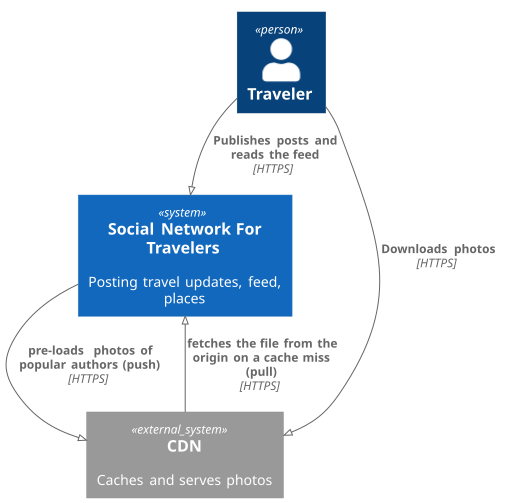
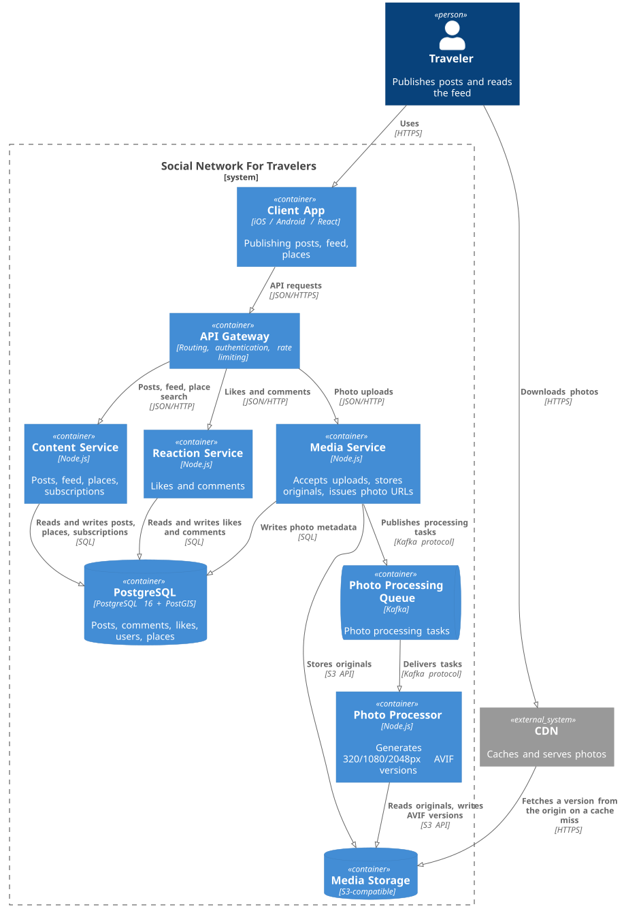

# System Design социальной сети для курса по [System Design](https://balun.courses/)

---

## Функциональные требования:
- публикация постов из путешествий с фотографиями, небольшим описанием и привязкой к конкретному месту путешествия;
- оценка и комментарии постов других путешественников;
- подписка на других путешественников, чтобы следить за их активностью;
- поиск популярных мест для путешествий и просмотр постов с этих мест;
- просмотр ленты других путешественников и ленты пользователя, основанной на подписках в обратном хронологическом порядке;
- взаимодействие с системой должно быть удобным: мобильные устройства и браузер;

## Нефункциональные требования:
- Сервис может быть недоступен от 4 до 8 часов в год (99.9% или 99.95%)
- DAU (Daily Active Users) 10 000 000;
- Аудитория стран СНГ(на зарубежный рынок выходить планов нет);
- Данные пользователей должны храниться всегда;
- Активности пользователя:
  - 100 запросов ленты в день, в одной выдаче 10 постов;
  - 2 поста в месяц;
  - 5 лайков в день;
  - 3 комментария в неделю;
  - 3 подписки в месяц;
- Не всё содержимое поста грузится вместе с лентой. Дополнительные запросы:
  - полный список комментариев — открывается в 10% просмотров;
  - список лайкнувших — открывается в 1% просмотров;
  - фото в полном размере — открывается в 1% просмотров постов, в среднем 2 фото;

## Лимиты:
- У пользователя может быть максимум 1 000 000 подписчиков;
- В среднем пользователь подписан на 200 человек;
- Пост может содержать максимум 10 фотографий, в среднем 5;
- Максимальный размер одного фото при загрузке — 10 МБ, в среднем 3 МБ;
  форматы JPEG/HEIC/PNG;
- Пост может содержать максимум 10 комментариев, в среднем 7.6;
- Описание поста — до 500 байт (кириллица UTF-8: 2 байта на символ);
- Текст комментария — до 120 байт;
- При загрузке фото генерируются четыре версии:
  - миниатюра 320px, AVIF — ~15 KB (сетки постов в профиле и на странице места)
  - превью 1080px, AVIF — ~75 KB (лента)
  - полный размер 2048px, AVIF — ~250 KB (просмотр фото на весь экран)
  - оригинал — до 10 MB, в среднем 3 MB. Клиентам не отдаётся; хранится всегда, из него можно перегенерировать версии

## Сезонность и пики:
- Сезонный множитель (лето к среднегодовому):
  - публикация постов — ×3 (люди в поездках);
  - чтение ленты, лайки, комментарии — ×2;
- Суточный множитель (вечерний пик 19:00–23:00) — ×2;


## Тайминги:
- создание поста 1 секунда;
- получение ленты 2 секунды;
- добавление комментария < 1 секунды;
- добавление лайка < 1 секунды;


### Нагрузка:
**Posts:**

Пиковый множитель на загрузку: 3 (сезонный) × 2 (суточный) = ×6

RPS(write) avg = 10 000 000 * (2 / 30) / 86400 = 7.72
RPS(write) peak = RPSavg * Пиковый множитель = 7.72 * 6 = 46

Пиковый множитель на чтение: 2 (сезонный) × 2 (суточный) = ×4

RPS(read) avg = 10 000 000 * 100 /86400 = 11 574
RPS(read) peak = 11 574 * 4 = 46 296

Система Read-Heavy. Запросов на чтение почти в 1500 раз больше, чем на запись.


**Likes:**

Пиковый множитель на запись: 2 (сезонный) × 2 (суточный) = ×4
RPS(write) avg = 10 000 000 * 5 / 86400 = 578,7
RPS(write) peak = 578.7*4 = 2 314

Пиковый множитель на чтение: 2 (сезонный) × 2 (суточный) = ×4
RPS(read) avg = 10 000 000 * (100 * 0.01)/86400 = 115,7
RPS(read) peak = 115,7 * 4 = 462,8

**Comments:**

Пиковый множитель на запись: 2(сезонный)*2(суточный) = x4

RPS(write) avg = 10 000 000 * (3/7) / 86400 = 49.6
RPS(write) peak = 49.6 * 4 = 198,4

Пиковый множитель на чтение: 2(сезонный)*2(суточный) = x4
RPS(read) avg = 10 000 000 * (100 *0.1)/86400 = 1 157
RPS(read) peak = 1 157  * 4 = 4 628

**Subscriptions:**

Пиковый множитель на запись: 2 (сезонный) × 2 (суточный) = ×4

RPS(write) avg = 10 000 000 * (3/30)/86400 = 11,6
RPS(write) peak = 11.6*4 = 46.4

RPS(read) = 0 (учитывается при чтении ленты постов)

**Трафик:**

Post:
- id (bigint) 8 bytes
- user_id (bigint) 8 bytes
- place_id (bigint) 8 bytes
- description (string) 500 bytes
- photos (массив из 10 ссылока каждая по 8 bytes ) 80 bytes
- created_at (timestamp) 8 bytes
- updated_at (timestamp) 8 bytes
- likes_count (int/bigint) 8 bytes
- comments_count (int/bigint) 8 bytes
AVG размер = 650 bytes

Posts:
Метаданные(READ):
Пиковый множитель на чтение: 2 (сезонный) × 2 (суточный) = ×4
Traffic avg = 11 574 * 650bytes * 10 = 75 231 000 bytes/s = 71.7 MB/s
Traffic peak = 71.7 MB/s * 4 = 286,8MB/s

Метаданные(WRITE):
Пиковый множитель на загрузку: 3 (сезонный) × 2 (суточный) = ×6
Traffic avg = 7.72 * 650bytes = 5 018 bytes/s = 4.9KB/s
Traffic peak = 4.9KB/s * 6 = 29,4KB/s

Media(READ):
В ленте грузим превью 1080px AVIF (1 фото на пост, ~75 KB), при открытии — версию 2048px AVIF (~250 KB). Оригиналы клиентам не отдаются

Пиковый множитель на чтение: 2 (сезонный) × 2 (суточный) = ×4


Превью:
Traffic avg = 11 574 × 10 × 1 × 75 KB = 8 680 500 KB = 8.7 GB/s
Traffic peak = 8.7 * 4 = 34.8 GB/s

Полный размер (1% просмотров, 2 фото, 2048px AVIF ~250 KB):
Traffic avg = 0.01 * 250 KB * 2 * 11 574 * 10 = 578 700 KB/s = 0.58 GB/s
Traffic peak = 0.58 * 4 = 2.3 GB/s

Итого media read peak = 34.8 + 2.3 = 37 GB/s (~296 Гбит/с)

Отдаётся через CDN, cache hit ~95%.
На origin приходится ~5%: peak ≈ 1.85 GB/s (~14.8 Гбит/с)

Media(Write):
Пиковый множитель на загрузку: 3 (сезонный) × 2 (суточный) = ×6
Traffic avg = 7.72 * 15 MB = 115.8 MB/s
Traffic peak = 115.8 * 6 = 695 MB/s

Comment:
- id (bigint) 8 bytes
- post_id (bigint) 8 bytes
- user_id (bigint) 8 bytes
- text (string) 120bytes
- created_at (timestamp) 8 bites
AVG размер = 160 bytes

Read:
Пиковый множитель на чтение: 2 (сезонный) × 2 (суточный) = ×4
Traffic avg = 1 157 * (160* 7.6 - размер одного ответа с комментами) = 1157*1216bytes =1.34MB/s
Traffic peak = 4 628 * 1216bytes/s = 5.37Mb/s

Write:
Пиковый множитель на загрузку: 2 (сезонный) × 2 (суточный) = ×4
Traffic avg = 49.6 * 160 = 7.75KB/s
Traffic peak = 198 * 160bytes/s = 31KB/s


Subscription:
- follower_id (bigint) 8 bytes
- followee_id (bigint) 8 bytes
AVG размер = 16 bytes

Subscriptions:
Метаданные(WRITE):
Пиковый множитель на загрузку: 2 (сезонный) × 2 (суточный) = ×4
Traffic avg = 11.57 * 16 bytes = 185 bytes/s
Traffic peak = 46.28 * 16 bytes = 741 bytes/s


Like:
- id (uuid) 16 bytes
- user_id (uuid) 16 bytes
- post_id (uuid) 16 bytes
- created_at (timestamp) 8 bytes
AVG размер = 56 bytes

Likes:
Write: Пиковый множитель: 2 (сезонный) × 2 (суточный) = ×4
Traffic avg = 578.7 * 56 B = 32.4 KB/s
Traffic peak = 32.44 = 129.6 KB/s

Read (список лайкнувших, 1% запросов ленты, ~75 лайков в выдаче):

Traffic avg = 115.7 * 56 B * 75 = 486 KB/s 
Traffic peak = 486 * 4 = 1.9 MB/s

Connections = 10 000 000 * 0.1 = 1 000 000


## API:

### Посты (Posts)
* `GetPost(params...)`
* `CreatePost(params...)`
* `UpdatePost(params...)`
* `DeletePost(params...)`
* `ListPosts(params...)`
* `ListPostsByPlace(params...)`

### Места (Places)
* `SearchPlaces(params...)`

### Лайки (Likes)
* `ToggleLike(params...)`
* `ListLikes(params...)`

### Комментарии (Comments)
* `GetComment(params...)`
* `CreateComment(params...)`
* `UpdateComment(params...)`
* `DeleteComment(params...)`
* `ListComments(params...)`

### Подписки (Subscriptions)
* `Subscribe(params...)`
* `Unsubscribe(params...)`


## Оценка потребления дисков для хранения и обработки всех этих данных приложения на 1 год
| Тип      | Объём | IOPS   | Throughput |
|----------|-------|--------|------------|
| HDD      | 2 TB  | 100    | 100 MB/s   |
| SSD SATA | 10 TB | 1 000  | 500 MB/s   |
| SSD NVMe | 4 TB  | 10 000 | 3 GB/s     |

**Посты**

```
Capacity          = 7.72 * 650 B * 86 400 * 365 ≈ 158 GB/год ≈ 0.16 TB
Throughput (peak) = 286.8 MB/s + 0.03 MB/s ≈ 287 MB/s
IOPS (peak)       = 46 296 + 46 = 46 342

Disks = max(capacity / disk_capacity, throughput / disk_throughput, iops / disk_iops)

HDD:      max(0.16/2 → 1,  287/100 → 3,   46 342/100 → 464)   = 464
SSD SATA: max(0.16/10 → 1, 287/500 → 1,   46 342/1 000 → 47)  = 47
SSD NVMe: max(0.16/4 → 1,  287/3 000 → 1, 46 342/10 000 → 5)  = 5
```

**Выбор: SSD NVMe, 5 дисков.** Подсистема read-heavy, количество дисков определяется IOPS
чтения ленты, а объём данных маленький. Поэтому нужен носитель с максимальным IOPS на диск:
NVMe закрывает нагрузку 5 дисками против 47 SATA и 464 HDD.


**Комментарии**

```
Capacity          = 49.6 * 160 B * 86 400 * 365 ≈ 250 GB/год ≈ 0.25 TB
Throughput (peak) = 5.37 MB/s + 0.03 MB/s ≈ 5.4 MB/s
IOPS (peak)       = 4 628 + 198 = 4 826

HDD:      max(0.25/2 → 1,  5.4/100 → 1,   4 826/100 → 49)    = 49
SSD SATA: max(0.25/10 → 1, 5.4/500 → 1,   4 826/1 000 → 5)   = 5
SSD NVMe: max(0.25/4 → 1,  5.4/3 000 → 1, 4 826/10 000 → 1)  = 1
```

**Выбор: SSD NVMe, 1 диск.** Как и у постов, упираемся в IOPS чтения (полный список
комментариев открывают в 10% просмотров). Один NVMe загружен по IOPS примерно на 48%,
запас есть. 5 SATA SSD дали бы тот же результат, но дороже.

**Лайки**

```
Capacity          = 578.7 * 56 B * 86 400 * 365 ≈ 1 TB/год
Throughput (peak) = 1.9 MB/s + 0.13 MB/s ≈ 2 MB/s
IOPS (peak)       = 463 + 2 314 = 2 777

HDD:      max(1/2 → 1,  2/100 → 1,   2 777/100 → 28)    = 28
SSD SATA: max(1/10 → 1, 2/500 → 1,   2 777/1 000 → 3)   = 3
SSD NVMe: max(1/4 → 1,  2/3 000 → 1, 2 777/10 000 → 1)  = 1
```

**Выбор: SSD NVMe, 1 диск.** Единственная write-heavy подсистема: записей в 5 раз больше,
чем чтений. Упираемся в IOPS. Объём растёт на ~1 TB в год и хранится всегда, поэтому
через 3–4 года диск на 4 TB заполнится и упрёмся уже в capacity — учесть при шардировании.

**Пользователи и подписки**

Допущение: всего пользователей ~10 млн, запись пользователя ~330 B.

```
Capacity          = users 10 000 000 * 330 B ≈ 3.3 GB
                  + subscriptions 11.6 * 16 B * 86 400 * 365 ≈ 5.9 GB/год
                  ≈ 9 GB
Throughput (peak) < 1 MB/s
IOPS (peak)       ≈ 46 (новые подписки)

HDD:      max(1, 1, 46/100 → 1)    = 1
SSD SATA: max(1, 1, 46/1 000 → 1)  = 1
SSD NVMe: max(1, 1, 46/10 000 → 1) = 1
```

**Выбор: SSD SATA, 1 диск.** Нагрузка минимальная по всем трём параметрам, хватает одного
диска любого типа. SSD вместо HDD — ради меньшей задержки: профиль пользователя
и список подписок нужны при сборке ленты.

**Места**

Допущение (в требованиях нет): пользователь ищет места 5 раз в день.
RPS avg = 10 000 000 * 5 / 86 400 ≈ 579, peak = 579 * 4 ≈ 2 315.
Мест ~10 млн, запись ~300 B (с учётом geography-точки).

```
Capacity          = 10 000 000 * 300 B ≈ 3 GB (растёт медленно — места переиспользуются)
Throughput (peak) = 2 315 * 20 мест в выдаче * 300 B ≈ 14 MB/s
IOPS (peak)       ≈ 2 315

HDD:      max(1, 1, 2 315/100 → 24)    = 24
SSD SATA: max(1, 1, 2 315/1 000 → 3)   = 3
SSD NVMe: max(1, 1, 2 315/10 000 → 1)  = 1
```

**Выбор: SSD NVMe, 1 диск.** Данных мало, упираемся в IOPS поиска по GiST-индексу.

**Фото: версии для отдачи (320 / 1080 / 2048 px AVIF)**

Фото в год = 7.72 * 5 * 86 400 * 365 ≈ 1.22 млрд. Версии на одно фото: 15 + 75 + 250 = 340 KB.

```
Capacity          = 1.22 млрд * 340 KB ≈ 414 TB/год
Throughput (peak) = 1.85 GB/s (отдача на CDN) + 46 * 5 * 340 KB ≈ 78 MB/s (запись) ≈ 1.93 GB/s
IOPS (peak)       = чтение с origin: (46 296 * 10 + 46 296 * 10 * 0.01 * 2) * 0.05 ≈ 23 600
                  + запись: 46 * 5 * 3 версии ≈ 700
                  ≈ 24 300

HDD:      max(414/2 → 207,  1 930/100 → 20,  24 300/100 → 243)    = 243
SSD SATA: max(414/10 → 42,  1 930/500 → 4,   24 300/1 000 → 25)   = 42
SSD NVMe: max(414/4 → 104,  1 930/3 000 → 1, 24 300/10 000 → 3)   = 104
```

**Выбор: SSD SATA, 42 диска.** Здесь важны и объём, и IOPS одновременно: HDD не вытягивает
IOPS, у NVMe маленький объём на диск. SATA SSD даёт лучший баланс.

**Фото: оригиналы**

```
Capacity          = 1.22 млрд * 3 MB ≈ 3.65 PB/год
Throughput (peak) = 695 MB/s (только запись, клиентам не отдаются)
IOPS (peak)       = 46 * 5 ≈ 230

HDD:      max(3 650/2 → 1 825,  695/100 → 7,   230/100 → 3)    = 1 825
SSD SATA: max(3 650/10 → 365,   695/500 → 2,   230/1 000 → 1)  = 365
SSD NVMe: max(3 650/4 → 913,    695/3 000 → 1, 230/10 000 → 1) = 913
```

**Выбор: HDD, 1 825 дисков.** Холодное хранилище: нагрузка чисто по объёму, IOPS
и throughput почти нулевые, поэтому решает цена за TB, а она у HDD минимальная.
С реальными HDD на 20 TB вышло бы ~183 диска.

### Итого

| Подсистема              | Носитель | Дисков | Упираемся в        |
|-------------------------|----------|--------|--------------------|
| Посты                   | SSD NVMe | 5      | IOPS               |
| Комментарии             | SSD NVMe | 1      | IOPS               |
| Лайки                   | SSD NVMe | 1      | IOPS, затем объём  |
| Пользователи и подписки | SSD SATA | 1      | —                  |
| Места                   | SSD NVMe | 1      | IOPS               |
| Фото: версии            | SSD SATA | 42     | объём и IOPS       |
| Фото: оригиналы         | HDD      | 1 825  | объём              |

Оценка без репликации и без индексов: объём метаданных с индексами ≈ ×2,
итоговое число дисков умножается на replication factor.


## Архитектура

Для описания архитектуры используется [C4 model](https://c4model.com/):
первый уровень показывает систему в окружении пользователей и внешних систем,
второй — из каких контейнеров она состоит и как между ними движутся данные.

**Level 1. System context diagram**

<p align="center">
  
</p>

**Level 2. Container diagram**

<p align="center">
  
</p>